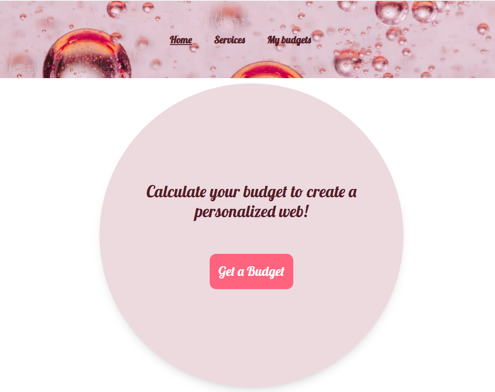

# BUDGET GENERATOR WEB APP (React)

Dynamic web app to generate service budgets using React. 
The users can select multiple services, fill the clients' data and save the budgets generated, as well as sharing the url of a budget. The budgets' list can be sorted by name, date and import and you can also search by name. 
The app uses components, organized following the principles of atomic design, and routing via react-router-dom.

# Demo



# Tech Stack

- **React 19**
- **Typescript**
- **Vite** for fast dev environment
- **ESLint** for linting
- **Tailwind CSS** for utility-first styling
    - Includes @tailwindcss/forms if used
    - Uses clsx for conditional class names
- **Atomic Design** structure
- **React Router DOM**
- **uuid** for generating unique IDs

# Intallation

Follow these steps to get the project running locally:
```bash
# 1. Clone the repository
git clone https://github.com/ireneruiz00/S6.Budget-with-react.git
cd S6.Budget-with-react

# 2. Install dependencies
npm install

# 3. Start the development server
npm run dev
```
---

# Usage

  Navigate to the services page

  Select the desired services and your preference in payment frequency

  If Web is selected, explore the web options

  Fill out the form and save your budget

  Go to the budget list page to view saved budgets

  Use the buttons to sort by name, date or import the order

  Use the search input

# What I learned

  How to set up a modern React project with Vite, ensuring fast development builds and hot reloading.

  Using TypeScript for type safety and better development experience.

  Structuring components, hooks, and context for clean, reusable code.

  Leveraging Tailwind CSS to create responsive, utility-first UIs.

  Managing component states for UI interactions (toggles, forms, active buttons).

  Managing complex UI logic using useState, useEffect, and useContext.

  Using custom hooks (useSelectedServices) for separation of concerns.

  Dynamically updating the UI based on user selections (e.g., services, pricing, quantity).

  Setting up React Router to manage navigation between pages (e.g., Calculator, Budgets).

  eading and writing search parameters in the URL to create a dynamic, shareable experience.